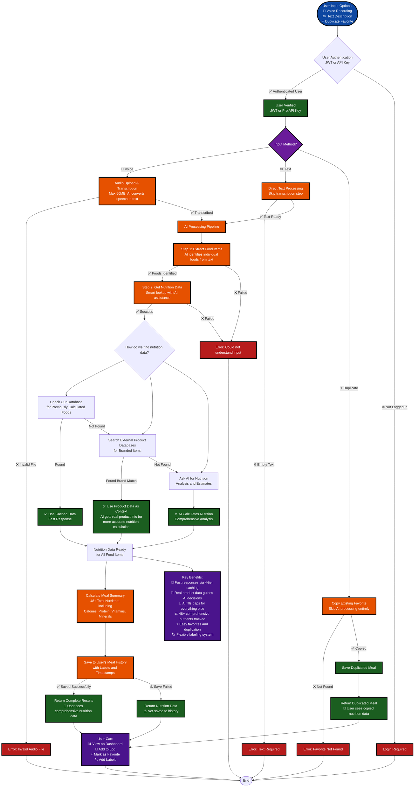

# noot 🍎

[](https://github.com/GrantBirki/noot/actions/workflows/test.yml)

An AI-powered nutrition logging web app. Just say what you ate!

- Press and hold the mic button, speak your consumption.
- Backend (Go) transcribes with OpenAI, parses items, fetches nutrients from an API based LLM.
- Returns a complete nutrient profile summary with calories, protein, carbs, fiber, vitamins, minerals, etc.

## Nutrients

This project aims to track 48+ total nutrients using a **centralized definition system**:

Adding nutrients is now super easy! See [Nutrient System Documentation](internal/nutrients/README.md)

**Quick Add Example:**

```yaml
# Add to config/nutrients.yml
- key: taurine_mg
  type: float64
  unit: mg
  category: amino_acid
  per_100g: true
  original: true
  go_field_name: Taurine
  json_tag: taurine_mg
  display_name: Taurine
```

Then run: `script/generate-nutrients` → All 20+ files automatically updated!

**Currently tracked nutrients:**

- total_calories
- total_protein_g
- total_fat_g
- total_carbs_g
- dietary_fiber_g
- total_sodium_mg
- saturated_fat_g
- trans_fat_g
- cholesterol_mg
- total_sugars_g
- added_sugars_g
- vitamin_a_mcg
- vitamin_c_mg
- vitamin_d_mcg
- vitamin_e_mg
- vitamin_k_mcg
- thiamine_mg
- riboflavin_mg
- niacin_mg
- vitamin_b6_mg
- folate_mcg
- vitamin_b12_mcg
- biotin_mcg
- pantothenic_acid_mg
- choline_mg
- calcium_mg
- iron_mg
- magnesium_mg
- phosphorus_mg
- potassium_mg
- zinc_mg
- copper_mg
- manganese_mg
- selenium_mcg
- iodine_mcg
- molybdenum_mcg
- chromium_mcg
- fluoride_mg
- chloride_mg
- omega3_ala_g
- omega3_epa_g
- omega3_dha_g
- omega6_g
- creatine_mg
- caffeine_mg
- alcohol_g
- polyunsaturated_fat_g
- monounsaturated_fat_g

## Consumption Flow Diagram

This diagram shows the simplified user journey from input to saved meal data, focusing on the user experience and key business logic rather than technical implementation details. The full technical flow is [documented separately here](./docs/consumption_flow_diagram.md).



## Quick Start

### Backend (Go API)

1) **Setup Dependencies:**

    ```bash
    script/bootstrap
    ```

2) **Get API Keys:**

   - OpenAI API key from [platform.openai.com](https://platform.openai.com/api-keys)

3) **Configure:**

    ```ini
    # create .env file

    # Required
    OPENAI_API_KEY=<key>

    # Server Configuration - Use port 3001 for API to avoid conflict with SvelteKit frontend
    PORT=3001
    ENV=development

    # CORS Configuration - Allow SvelteKit frontend
    CORS_ALLOWED_ORIGINS=http://localhost:3000

    # Logging & Debugging (Enable detailed error reporting)
    LOG_LEVEL=DEBUG
    DEBUG=true

    # OpenAI Configuration
    OPENAI_TRANSCRIBE_MODEL=gpt-4o-mini-transcribe

    TRANSCRIBE_LANGUAGE=en
    #OPENAI_TRANSCRIBE_RESPONSE_FORMAT=

    # Upload Configuration
    MAX_UPLOAD_BYTES=104857600  # Maximum upload size in bytes (default: 100MB)

    # Database Configuration - Use Supabase for local and production
    # Follow Supabase local development setup: https://supabase.com/docs/guides/local-development
    ```

4) **Run the API:** `PORT=3001 script/server` (use `--production` for production mode).

### Frontend (SvelteKit)

1) **Setup Dependencies:**

    ```bash
    script/bootstrap
    ```

2) **Run the web app:**

    ```bash
    script/frontend
    ```

    Or to start without opening the browser:

    ```bash
    script/frontend --no-open
    ```

3) **Use:**

   - Visit [http://localhost:3000](http://localhost:3000) (SvelteKit frontend)
   - API runs on [http://localhost:3001](http://localhost:3001) (Go backend)
   - Press the microphone button on the record page
   - Say what you consumed (e.g., "I had a latte with organic whole milk and Greek yogurt with blueberries")
   - See your nutrition summary with client-side unit conversion (grams ↔ ounces)

## API Endpoints

### v1 API

- `GET /api/v1/health` — Health check with server status
- `POST /api/v1/consumption` — Multipart form with `audio` field (webm/opus/mp3/wav)
- `GET /api/v1/consumptions` — View stored consumptions with optional date range filtering. Supports tier-based limits: Free users can access up to 7 days, Pro users up to 365 days (development mode only)
- `GET /api/v1/docs` — Interactive API documentation via Swagger UI (development mode only)
- `GET /api/v1/openapi.yaml` — OpenAPI 3.0.3 specification (development mode only)

### Frontend Endpoints

- `GET /version` — Version and build information including commit SHA, build time, and git tag

> **Note:** The embedded static frontend has been removed. The API now runs on port 3001 by default, and the SvelteKit frontend runs on port 3000.

## Development

### Backend (Go)

- **Test:** `script/test`
- **Lint:** `script/lint`  
- **Build:** `script/build` (or `script/build --single-target` for faster iteration)
- **Dev Server:** `PORT=3001 script/server` (use `script/server --production` for production mode)
- **API Docs:** Visit [http://localhost:3001/api/v1/docs](http://localhost:3001/api/v1/docs) when running in development mode

### Frontend (SvelteKit Site)

- **Dev Server:** `script/frontend` (runs on port 3000 and opens browser)
- **Dev Server (no browser):** `script/frontend --no-open`
- **Manual Dev:** `cd apps/web && npm run dev` (alternative manual approach)
- **Build:** `cd apps/web && npm run build`
- **Type Check:** `cd apps/web && npm run check`
- **Generate API Types:** `cd apps/web && npm run generate:api` (regenerates types from OpenAPI spec)

### API Development

The API follows OpenAPI `3.0.3` specification:

- **Specification:** `/api/v1/openapi.yaml`
- **Documentation:** `/api/v1/docs` (Swagger UI, development only)
- **Generate Types:** `script/generate-types` (requires oapi-codegen via the go toolchain - vendored in this project)
- **Frontend API Types:** Generated automatically by `openapi-typescript` from the OpenAPI spec

### Database Management

- **Reset:** `script/db reset` — Drop all tables and start fresh
- **Seed:** Handled by Supabase CLI during local development setup
- **Dump:** `script/db dump` — View database contents in human-readable format

### Deployment

The application supports automated deployment with built-in version tracking:

- **Deploy Frontend:** `script/deploy frontend` — Deploy SvelteKit app to Cloudflare Workers with git metadata
- **Deploy Backend:** `script/deploy backend` — Deploy Go API to Railway
- **Deploy Both:** `script/deploy` — Deploy both frontend and backend

**Version Tracking:**

- Each deployment automatically includes commit SHA, build time, and git tag
- Frontend deployments inject git metadata as environment variables during build
- Access version info at `/version` endpoint (both JSON API and UI page)
- Git metadata is extracted automatically during deployment process

**Requirements:**

- Frontend: `CLOUDFLARE_ACCOUNT_ID` and `CLOUDFLARE_API_TOKEN` environment variables
- Backend: `RAILWAY_TOKEN` environment variable

## Technical Details

### Backend

- Supabase/PostgreSQL database with CLI-managed migrations and seeding for consumption storage
- OpenAI gpt-4o-mini-transcribe for speech-to-text
- OpenAI gpt-4o-mini for consumption parsing with complete nutrition data
- Audio uploads are streamed to temporary files to avoid memory spikes
- JWT authentication via Supabase Auth for user management
- CORS middleware for cross-origin requests from frontend

### Frontend

- SvelteKit with TypeScript
- DaisyUI with custom "noot" theme for styling
- openapi-fetch for type-safe API calls
- Client-side unit conversion (grams ↔ ounces) with localStorage persistence
- MediaRecorder API for audio capture (webm/opus format preferred)
- Responsive design with mobile-friendly recording interface

### Architecture

- **Frontend**: SvelteKit ([http://localhost:3000](http://localhost:3000))
- **Backend**: Go API server ([http://localhost:3001](http://localhost:3001))
- **Database**: Supabase/PostgreSQL with automatic migrations
- **Audio Processing**: OpenAI Whisper via API

## Theme

- [Noot DaisyUI Theme](https://daisyui.com/theme-generator/#theme=eJx90u9ygyAMAPB3cV_rDhH_dG8DJFRuFLygt267vfuUujtrnX5LfiQm6Hfm5RWzt8yHMGSnTAcXKI-6w5R19tLN6Ty_g5IR84KxiV4MmBZxi3xBjoDlFss7AsAZ2BZ18AP6YT5Q6hIEXx3oyV4lfc6msBGVeLZ1vUnP6kzESWHpUFcNb9meHvaQWi_UCHVu6yc6rPY4DiRd2k6WSrBne6jfXq71JqTh66ZqxQaOdx-n6WLcHXyxw_oPSd76S7p71TCxY4f1SBRoFq54zYut_LM1SbBjnD6NQz2k-oLwuiZj0cFOXoXbOhvtF67bsNey4NWD_nV6JBUIML24v6UEYD90c5wiH2zEJQI0cnTTCka6iKesJzRIcfql3pfczy9KqQ75)
