# Complete `/api/v1/consumption` POST Flow Diagram

This diagram depicts the entire control flow from voice recording to consumption storage in the database, including all caching scenarios, AI provider interactions, and edge cases.

```mermaid
graph TB
    %% Starting point
    Start([Voice Recording Upload]) --> Auth{JWT Authentication<br/>Required for consumption endpoint}
    
    %% Authentication flow - AUTHENTICATION IS REQUIRED
    Auth -->|Valid JWT| AuthSuccess[Set auth_user in context]
    Auth -->|Missing Authorization header| AuthMissing[Return 401 Authorization header required]
    Auth -->|Invalid header format| AuthFormat[Return 401 Invalid authorization header format]
    Auth -->|Invalid/expired token| AuthInvalid[Return 401 Invalid token or Token expired]
    Auth -->|User not found| AuthUser[Return 404 User not found]
    Auth -->|Config error| AuthConfig[Return 500 Authentication configuration error]
    Auth -->|Service unavailable| AuthService[Return 503 Authentication service unavailable]
    
    AuthMissing --> End([End])
    AuthFormat --> End
    AuthInvalid --> End
    AuthUser --> End
    AuthConfig --> End
    AuthService --> End
    
    %% Request processing
    AuthSuccess --> ParseForm[Parse multipart form<br/>Max 50MB size limit]
    ParseForm -->|Success| ExtractAudio[Extract audio file from audio field]
    ParseForm -->|Error| FormError[Return 400 Bad Request]
    FormError --> End
    
    ExtractAudio -->|Success| SaveTemp[Save to temporary file<br/>with MIME type detection]
    ExtractAudio -->|No audio field| AudioError[Return 400 Bad Request]
    AudioError --> End
    
    %% Core nutrition service initialization
    SaveTemp --> CreateService[Create NutritionService<br/>with store and AI provider]
    
    %% Phase 1: Transcription
    CreateService --> Transcribe[TranscribeAudio via OpenAI<br/>Whisper model]
    Transcribe -->|Success| TranscribeSuccess[Sanitized transcript text]
    Transcribe -->|Error| TranscribeError[Return 500 Internal Server Error]
    TranscribeError --> CleanupTemp[Delete temporary file] --> End
    
    %% Phase 2: Parse Items
    TranscribeSuccess --> ParseItems[ParseItems via OpenAI<br/>Extract food items from transcript]
    ParseItems -->|Success| ValidateItems[Validate and sanitize item data<br/>Check name length quantities etc]
    ParseItems -->|Error| ParseError[Return 500 Internal Server Error]
    ParseError --> CleanupTemp
    
    %% Phase 3: Nutrition Hydration - CRITICAL: NEVER FAILS THE REQUEST
    ValidateItems --> CheckStore{Store available?}
    CheckStore -->|Yes| HydrateWithCache[HydrateNutrition with cache<br/>ALWAYS SUCCEEDS even if items fail]
    CheckStore -->|No| HydrateNoCache[HydrateNutritionWithoutCache<br/>ALWAYS SUCCEEDS even if items fail]
    
    %% Parallel processing of items with cache
    HydrateWithCache --> ParallelCache[Process items in parallel goroutines<br/>Individual failures are handled gracefully]
    ParallelCache --> ItemLoop[For each item hydrateItemNutrition]
    
    %% Cache flow for individual items
    ItemLoop --> CacheCheck[fetchNutritionFromCache]
    
    %% Cache hit scenarios
    CacheCheck --> ExactCache{Exact serving cache hit<br/>Fresh within 30 days?}
    ExactCache -->|Yes Fresh| ExactHit[Use cached exact serving data<br/>Scale if BaseQuantity greater than 1]
    ExactCache -->|No| BrandCache{Brand-aware cache key hit<br/>Fresh within 30 days?}
    BrandCache -->|Yes Fresh| BrandHit[Use brand-aware cached data]
    BrandCache -->|No| FallbackCache{Fallback cache key hit<br/>Fresh within 30 days?}
    FallbackCache -->|Yes Fresh| FallbackHit[Use fallback cached data]
    FallbackCache -->|No| ScalableCache{Scalable serving cache hit<br/>Fresh within 30 days?}
    ScalableCache -->|Yes Fresh| ScaleHit[Scale nutrition from<br/>cached serving size]
    ScalableCache -->|No| CacheMiss[Cache miss fetch from AI]
    
    %% Cache hits go directly to result
    ExactHit --> ItemComplete[Item hydrated with nutrition]
    BrandHit --> ItemComplete
    FallbackHit --> ItemComplete
    ScaleHit --> ItemComplete
    
    %% Cache miss flow
    CacheMiss --> FetchContext[fetchNutritionContext]
    FetchContext --> OFFCheck{Item has brand?}
    
    %% OFF Open Food Facts flow
    OFFCheck -->|Yes| OFFQuery[Query OFF database<br/>SearchProduct by name plus brand]
    OFFCheck -->|No| NoOFF[Skip OFF query]
    
    OFFQuery -->|Found| OFFFound[Extract ingredients URL<br/>Create nutrition context]
    OFFQuery -->|Not found| OFFNotFound[No OFF context]
    
    OFFFound --> FetchAI[fetchNutritionFromAI]
    OFFNotFound --> FetchAI
    NoOFF --> FetchAI
    
    %% AI Provider flow
    FetchAI --> GenericCheck{Generic item?<br/>No brand plus no OFF context}
    GenericCheck -->|Yes| CompleteAI[GetNutritionWithContextComplete<br/>Get nutrition plus ingredients plus URL]
    GenericCheck -->|No| StandardAI[GetNutritionWithContext<br/>Get nutrition only]
    
    CompleteAI --> AISuccess[AI response with complete data]
    StandardAI --> AISuccess
    FetchAI -->|Error| AIError[Log warning and use item without nutrition<br/>DOES NOT FAIL THE REQUEST]
    
    AISuccess --> CacheStore[cacheNutritionData<br/>Store in database cache]
    CacheStore --> ItemComplete
    AIError --> ItemWithoutNutrition[Item without nutrition data]
    
    %% Parallel processing without cache
    HydrateNoCache --> ParallelNoCache[Process items in parallel goroutines<br/>Individual failures handled gracefully]
    ParallelNoCache --> DirectOFF[Direct OFF query if branded]
    DirectOFF --> DirectAI[Direct AI provider calls]
    DirectAI --> ItemCompleteNoCache[Item hydrated or without nutrition]
    
    %% Collect results - ALWAYS SUCCEEDS
    ItemComplete --> CollectResults[Collect all parallel results<br/>HYDRATION ALWAYS SUCCEEDS]
    ItemWithoutNutrition --> CollectResults
    ItemCompleteNoCache --> CollectResults
    
    %% Phase 4: Response preparation
    CollectResults --> ConvertAPI[Convert internal types to API types<br/>Items without nutrition get Note field]
    ConvertAPI --> Summarize[Calculate nutrition summary<br/>totals for all items]
    
    %% Phase 5: Database storage
    Summarize --> StoreCheck{Store available?}
    StoreCheck -->|Yes| GetUser[getCurrentUser from JWT context]
    StoreCheck -->|No| SkipStorage[Skip database storage]
    
    GetUser -->|Success| CreateConsumption[Create Consumption record<br/>with transcript and totals]
    GetUser -->|Error| LogUserError[Log error continue without storage<br/>DOES NOT FAIL REQUEST]
    
    CreateConsumption -->|Success| SaveConsumption[CreateConsumption in database]
    CreateConsumption -->|Error| LogCreateError[Log error continue<br/>DOES NOT FAIL REQUEST]
    
    SaveConsumption -->|Success| SaveItems[Create ConsumptionItem records<br/>for each individual item]
    SaveConsumption -->|Error| LogSaveError[Log error continue<br/>DOES NOT FAIL REQUEST]
    
    SaveItems --> LinkItems[Try to link items to global cache<br/>using normalized names<br/>Individual failures logged but ignored]
    
    %% Response generation - ALWAYS SUCCEEDS
    LinkItems --> CreateResponse[Create ConsumptionResponse]
    SkipStorage --> CreateResponse
    LogUserError --> CreateResponse
    LogCreateError --> CreateResponse
    LogSaveError --> CreateResponse
    
    CreateResponse --> ResponseData[Response includes<br/>Consumption ID Transcript<br/>Items with nutrition or Note<br/>Nutrition summary Request ID]
    
    %% Final cleanup and response
    ResponseData --> CleanupTemp2[Delete temporary audio file]
    CleanupTemp2 --> Success[Return 200 OK with JSON<br/>ALWAYS SUCCEEDS after auth]
    Success --> End
    
    %% Styling - High contrast for accessibility
    classDef errorClass fill:#B71C1C,stroke:#000000,stroke-width:3px,color:#FFFFFF
    classDef successClass fill:#1B5E20,stroke:#000000,stroke-width:3px,color:#FFFFFF
    classDef cacheClass fill:#0D47A1,stroke:#000000,stroke-width:3px,color:#FFFFFF
    classDef aiClass fill:#E65100,stroke:#000000,stroke-width:3px,color:#FFFFFF
    classDef dbClass fill:#4A148C,stroke:#000000,stroke-width:3px,color:#FFFFFF
    classDef authClass fill:#BF360C,stroke:#000000,stroke-width:3px,color:#FFFFFF
    
    class AuthMissing,AuthFormat,AuthInvalid,AuthUser,AuthConfig,AuthService,FormError,AudioError,TranscribeError,ParseError errorClass
    class Success,ExactHit,BrandHit,FallbackHit,ScaleHit successClass
    class CacheCheck,ExactCache,BrandCache,FallbackCache,ScalableCache,CacheStore cacheClass
    class Transcribe,ParseItems,CompleteAI,StandardAI aiClass
    class CreateConsumption,SaveConsumption,SaveItems dbClass
    class Auth,AuthSuccess authClass
```

## Key Edge Cases and Flows Covered

### 1. Authentication Edge Cases (REQUIRED FOR CONSUMPTION ENDPOINT)

- Missing Authorization header → 401 "Authorization header required"
- Invalid authorization header format → 401 "Invalid authorization header format"  
- Invalid JWT token → 401 "Invalid token"
- Expired JWT token → 401 "Token expired"
- Valid token but user not found → 404 "User not found"
- JWKS/key resolution issues → 503 "Authentication service temporarily unavailable"
- Configuration errors → 500 "Authentication configuration error"

### 2. File Upload Edge Cases

- Invalid multipart form → 400 Bad Request
- Missing audio field → 400 Bad Request
- File too large (>50MB) → 400 Bad Request
- Successful upload → Temporary file creation with cleanup

### 3. Cache Hit Scenarios (30-day TTL)

- **Exact serving cache hit**: Direct match on normalized name + brand + grams (fresh within 30 days)
- **Brand-aware cache hit**: Uses improved normalization with brand context (fresh within 30 days)
- **Fallback cache hit**: Backward compatibility with old cache keys (fresh within 30 days)
- **Scalable cache hit**: Scale nutrition from different serving sizes using per-100g data (fresh within 30 days)
- **Cache miss**: Proceeds to AI provider

### 4. AI Provider Integration (NEVER FAILS THE REQUEST)

- **Generic items** (no brand): Use `GetNutritionWithContextComplete` to get ingredients + URL
- **Branded items**: Use `GetNutritionWithContext` with OFF context data
- **AI failures**: Log warnings and continue with items without nutrition data - NEVER fails entire request

### 5. Open Food Facts (OFF) Integration

- Only query OFF for items with brands (branded products)
- Extract ingredients, URLs, and nutrition context for AI
- Fallback gracefully if OFF query fails

### 6. Database Storage Edge Cases (NEVER FAIL THE REQUEST)

- **No store available**: Skip all database operations, return response
- **User authentication fails**: Log error, continue without storage
- **Consumption creation fails**: Log error, continue
- **Individual item storage fails**: Log error, continue with other items
- **Cache storage fails**: Log warning, continue (don't fail response)

### 7. Parallel Processing (ROBUST ERROR HANDLING)

- Process multiple food items concurrently using goroutines
- **Individual item failures are handled gracefully** - they get items without nutrition
- **HydrateNutrition ALWAYS succeeds** - even if all individual items fail
- Collect results and continue even if some items fail nutrition lookup

### 8. Data Validation and Security

- Sanitize transcript output from AI
- Validate item names and quantities
- Truncate overly long brand names
- Remove potentially dangerous content using bluemonday

### 9. Critical Success Guarantee

**After successful authentication, the request ALWAYS returns 200 OK**:

- Transcription failures → 500 error
- Parse failures → 500 error
- **But nutrition hydration, database storage, and caching failures are handled gracefully**
- Items without nutrition get a "Note" field: "Nutrition data unavailable"
- The response always includes transcript, items (with or without nutrition), and summary
